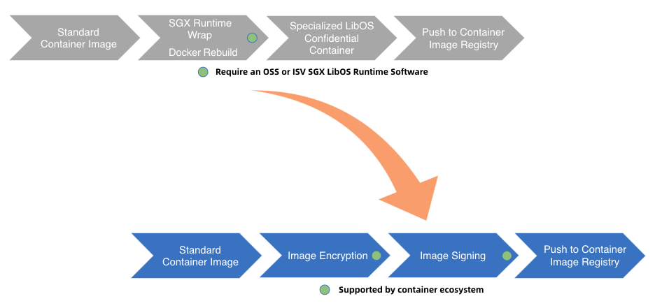
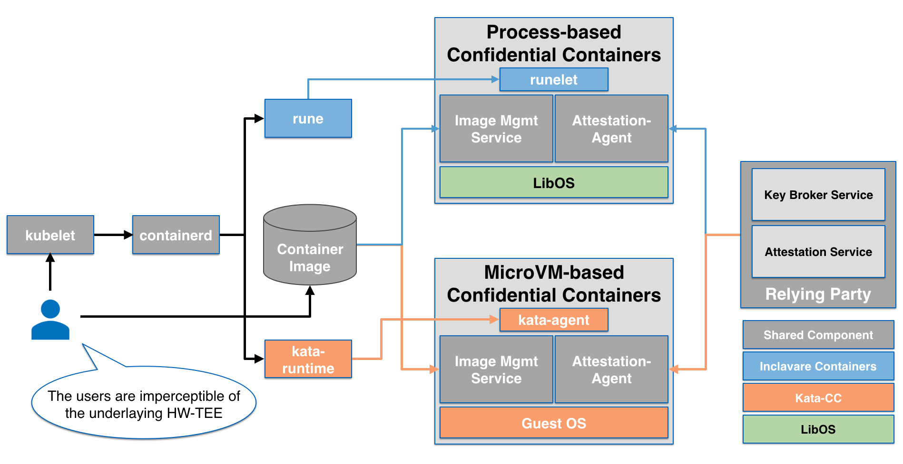
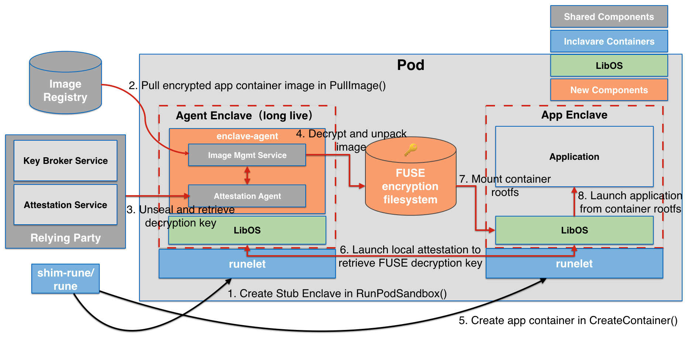
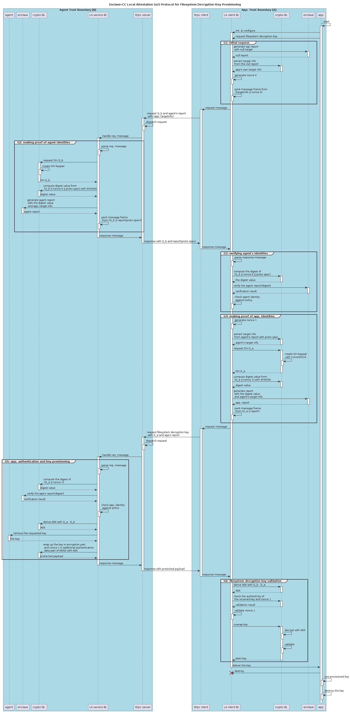

# Enclave Confidential Containers (Enclave-CC) Design and Architecture

## Motivation

The Confidential Containers project provides a way for cloud native applications to choose
Confidential Compute during deployment without modification to the containers. Confidential Compute
comes in two main flavors: process and virtual machine based isolation. The term enclave is often
associated with process-based isolation.

Enclave-CC enables process-based isolation. Process-based isolation is beneficial by drawing the
isolation boundary exactly around each container process. This reduces the Trusted Computing Base,
or the amount of the system your application depends on for security.

Consistent with the VM-based isolation design, the enclave-cc approach does not measure and attest
to the workload (your application). Instead it uses generic enclaves to isolate your containers from
the rest of the system. Measurement and attestation of the empty generic enclaves is used in
building trust to deliver the application securely.

## Goals

### Keep the same user experience among Confidential Containers

Several existing LibOS containerization solutions pay more attention to seamlessly running
applications into the enclave in enclave-unaware manner. However, those solutions don't provide the
image creation in enclave-unaware manner. Taking SGX LibOS solutions as examples, the image creator
requires extra steps to wrap LibOS runtimes into container image. This is a big burden for the user
experience when using process-based Confidential Containers. Especially each type of LibOS employs
its unique build technology to create container images.

Theoretically, LibOS runtimes are not parts of container workload, so the wrapping operation should
be removed from image creation flow. Instead, LibOS is purely used as a runtime or loader to host
the sensitive workloads in enclave. This approach targets a usage model where the decision to use
an enclave is at deployment time. One could for instance grab any unmodified container image
(optionally an encrypted container) out of a registry and target the deployment at an enclave.

As a result, the non-workload components running inside enclave are not mandatory to be provided
by image creator. Meanwhile, this approach can facilitate the development of standardization of
implementing Enclave-CC, which reuses the methodology of image protections already applied to the
container ecosystem, such as image [encryption](https://github.com/confidential-containers/guest-components/tree/main/ocicrypt-rs) and
[signing](https://github.com/containers/image/blob/main/docs/containers-signature.5.md), instead
of using LibOSes specific approaches.

### Align with Confidential Containers principles

Confidential Containers design principle tends to utilize and reuse ecosystem to implement
Confidential Containers. More specifically, Confidential Containers requires:

- Container image is always protected, e.g, signed and/or encrypted.
- Download and unpack container image to the secure and attested enclave for the actual workloads
to run with the protections of confidentiality and integrity.
- Prove that sensitive workloads are running on a genuine and trusted hardware TEE.
- Follow up trust and threat model defined by Confidential Containers.

Enclave-CC approach would strictly align with above design principles to implement a general
process-based Confidential Containers co-existing with VM-based Confidential Containers. It
provides a consistent Kubernetes user experience across hardware TEEs, but also compared with the
existing, non confidential Kubernetes usage patterns. The container workload is unmodified (but
encrypted/signed) and identical across hardware TEEs.

where:
- [Inclavare Containers Project](https://github.com/inclavare-containers/inclavare-containers) is
a container runtime to launch the process-based Confidential Container for Intel SGX.

- LibOS generally refers to the SGX LibOS implementations, such as
[Gramine](https://github.com/gramineproject/gramine) and
[Occlum](https://github.com/occlum/occlum).

- `rune` is the container runtime for spawning and running enclaves in containers.

- `runelet` is the containerized process used to interact with LibOS through common PAL APIs.

## Architecture

enclave-CC introduces a helper enclave called `agent enclave` which is a fixed function enclave.
It is launched by `shim-rune` during pod creation in a private method. More specifically,
`agent enclave` is deployed in the form of OCI bundle rather than a container image, and thus
`shim-rune` can call `rune` to start it. `agent enclave` has the same life cycle as the pod.
Its main job is to receive and then load the actual workload's container image into an
`app enclave`.

To do this securely both the agent and app enclaves establish trust through attestation.

`agent enclave` is responsible for hosting a LibOS loaded from OCI bundle previously mentioned
and `enclave-agent` on top of the LibOS. `enclave-agent` consists of
[image management service](https://github.com/confidential-containers/guest-components/tree/main/image-rs) and
[attestation agent](https://github.com/confidential-containers/guest-components/tree/main/attestation-agent). They are the
common pieces from Confidential Containers project.

FUSE encryption filesystem acts as a temporary storage, providing the protections for the metadata
and OCI bundle. There are many [alternatives](https://nuetzlich.net/gocryptfs/comparison/) to use.

The LibOS running inside `app enclave` needs to establish an attested channel to retrieve the
decryption key to mount FUSE encryption filesystem. The attested channel can be established in
several ways according to policy:
- launch a local attestation with `agent enclave`
- delegate `agent enclave` to proxy a remote attestation procedure (not drawn)

Then like the usual LibOS pattern it will call the container's entry point as though the container
was a process unto itself (rather than where it now sits like a library in the LibOS PAL process).

## [Future Work] Local Attestation for Filesystem Decryption Key Provisioning

A local attestation (LA) feature is needed for authentication/authorization and secret provisioning
between an Agent-enclave instance and a set of App-enclave instances resided in a same Pod. The
agent holds a secret for filesystem decryption and the app wants to authenticate to the agent in
order for the agent to release the filesystem decryption key (FDK). The app-enclave will prove its
identity with a report and the agent will check that against a policy which requires a matching
`MRSIGNER` or `MRENCLAVE`, possibly including an additional value from KSS. This design is a guide
for enclave-CC developers to implement this feature.

In this design, we leverages the `AEAD` algorithm for FDK protection over `ttrpc` channel. It is a
recommended cryptographic algorithm in IETF, see [rfc5116](https://datatracker.ietf.org/doc/html/rfc5116).
Regarding the ephemeral Diffie-Hellman key exchange, we chooses the Curve25519, which is recommended
by IETF [rfc8031](https://www.rfc-editor.org/rfc/rfc8031). The design doesn't include the agent
authentication in enclave-CC security context, however, the app can easily add app side user defined
policy to enhance the security configuration.

In most scenarios, it is one-shot transactions used for single FDK provisioning. However, this LA
protocol can easily be extended to provision multiple keys for more general purposes or, for
example, multiple application containers in the same pod.

To achieve this, it is necessary to add a key id to the second request message sent along G_a and
app's report, with the key id being used to indicate which key is being requested. But whether the
key id can be automatically enumerated or not is decided by the caller `ttrpc` service/client and
their contexts. At this moment, the caller is not discussed yet. We hope to merge the protocol
definition completed prior to the implementation. By then, we could make the final decision to add
the key id into protocol or not.

In addition to adding this ID, the generated nonce and derived `AEAD` keyset expected to be cached
on both sides to keep the secure session alive which has been established in initial transaction.
The session's security context will hold those cached values to ensure AIC triad and freshness for
subsequent key provisioning requests.

Furthermore, agent or app. should set the expiration time of its own security context properly to
minimize risk exposure. Upon closing of underlying `ttrpc` connection, the security context will be
cleared accordingly.

Please note that there is no secure transport configured between `ttrpc` endpoints in our case,
therefore we rely on the confidentiality and integrity measures of `AEAD` to protect the FDK over
this transport. Furthermore, the `ttrpc` service needs to be strictly configured to listen on
loopback interface only for security.
