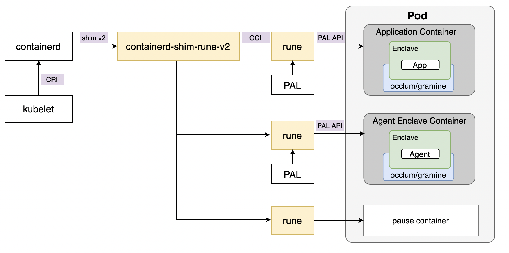

# containerd-shim-rune-v2

containerd-shim-rune-v2 is a shim for Enclave CC.

## Introduction



## Build requirements

Go 1.13.x or above.

## How to build and install

### Step 1: Build and install shim binary.

```bash
git clone https://github.com/confidential-containers/enclave-cc

cd src/shim
GOOS=linux make binaries
make install
```

### Step 2: Configuration

Modify containerd configuration file(/etc/containerd/config.toml) and add runtimes rune into it.

```toml
#...
      [plugins.cri.containerd.runtimes.rune]
        runtime_type = "io.containerd.rune.v2"
#...
```
